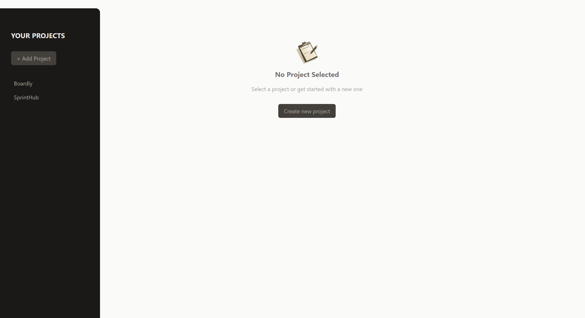
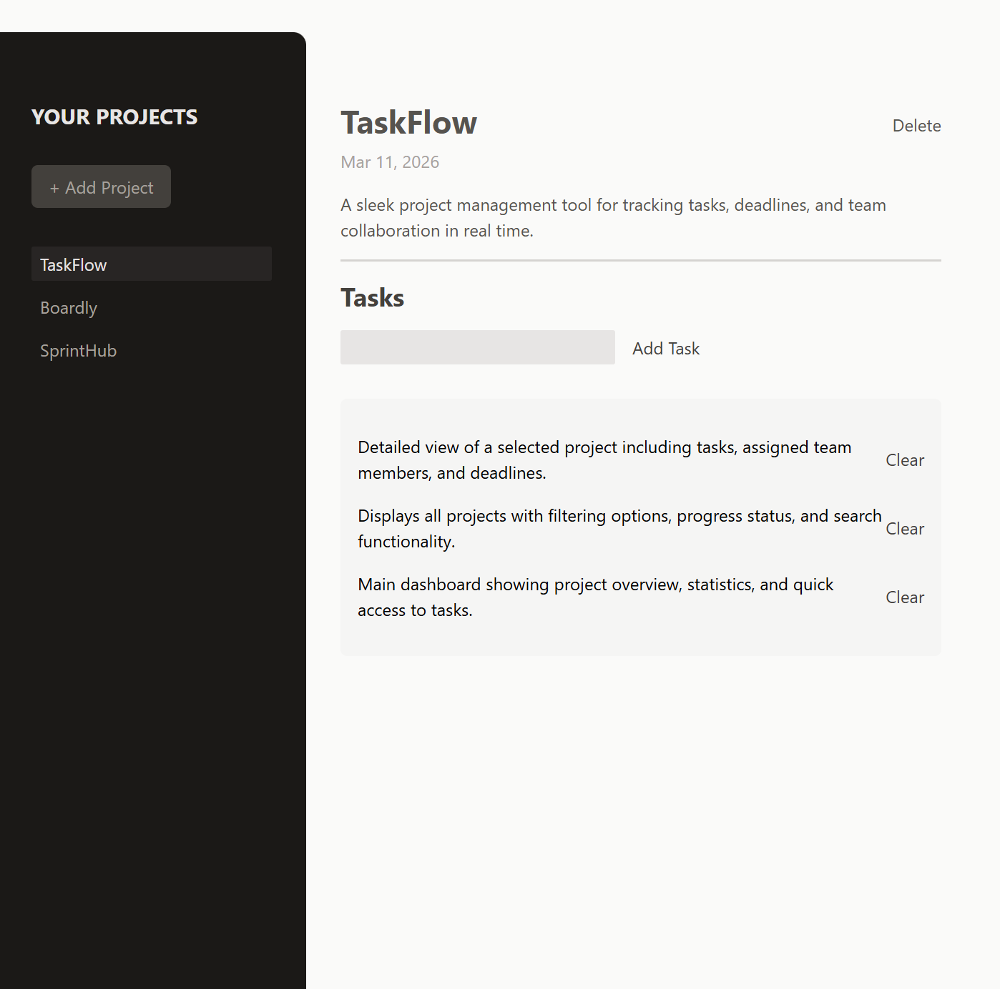
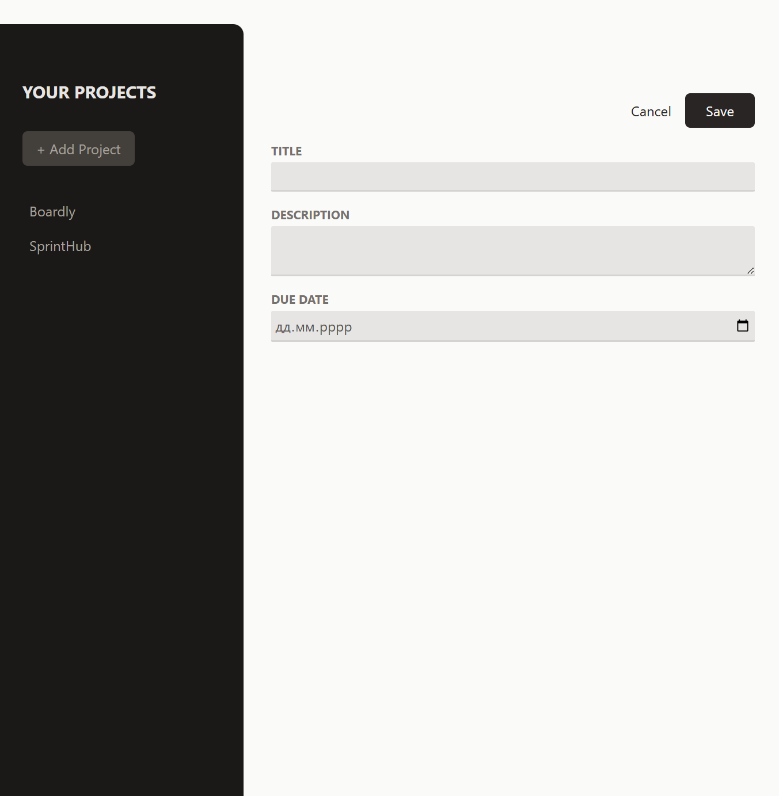

# Project Management Application

A modern, responsive project and task management application built with React. Organize your projects, manage tasks efficiently, and stay productive with an intuitive user interface.

---

## 🚀 [Live Demo](https://react-project-manager-pearl.vercel.app/)

## 📸 Screenshots

### Homepage


### Dashboard


### New Project

public/
---

## 🎯 Features

- **Project Management**: Create, view, and delete projects with ease
- **Task Management**: Add and remove tasks associated with each project
- **Project Selection**: Select projects from a sidebar to view and manage their tasks
- **Responsive Design**: Built with Tailwind CSS for a clean, modern interface
- **State Management**: Efficient state handling with React Hooks
- **Modal Forms**: User-friendly modal dialogs for creating new projects and tasks

## 🚀 Tech Stack

- **React 19.0**: Latest React version with modern hooks
- **Vite 4.4**: Fast build tool and dev server
- **Tailwind CSS 3.3**: Utility-first CSS framework
- **PostCSS**: CSS processing with autoprefixer
- **ESLint**: Code quality and consistency

## 📦 Installation

### Prerequisites

- Node.js (v16 or higher)
- npm or yarn package manager

### Setup

1. Clone the repository:

```bash
git clone https://github.com/vasylpryimakdev/react-project-manager.git
cd refs-demo-project
```

2. Install dependencies:

```bash
npm install
```

## 🎮 Usage

### Development Server

Start the development server with hot module replacement:

```bash
npm run dev
```

The application will open at `http://localhost:5173`

### Build for Production

Create an optimized production build:

```bash
npm run build
```

### Preview Production Build

Preview the production build locally:

```bash
npm run preview
```

### Linting

Run ESLint to check code quality:

```bash
npm run lint
```

## 📁 Project Structure

```
refs-demo-project/
├── src/
│   ├── components/
│   │   ├── Button.jsx              # Reusable button component
│   │   ├── Input.jsx               # Reusable input component
│   │   ├── Modal.jsx               # Modal dialog component
│   │   ├── NewProject.jsx          # Create project form
│   │   ├── NewTask.jsx             # Create task form
│   │   ├── NoProjectSelected.jsx   # Empty state component
│   │   ├── ProjectsSidebar.jsx     # Projects list sidebar
│   │   ├── SelectedProject.jsx     # Selected project view
│   │   └── Tasks.jsx               # Tasks list display
│   ├── App.jsx                     # Main application component
│   ├── main.jsx                    # Entry point
│   ├── index.css                   # Global styles
│   └── assets/                     # Static assets
├── public/                         # Public static files
├── index.html                      # HTML template
├── vite.config.js                  # Vite configuration
├── tailwind.config.js              # Tailwind CSS configuration
├── postcss.config.js               # PostCSS configuration
└── package.json                    # Project dependencies
```

## 🎓 Learning Resource

This project demonstrates key React concepts:

- **Hooks**: Implementing state management with `useState`
- **Component Composition**: Building reusable UI components
- **State Lifting**: Managing shared state across the component tree
- **Conditional Rendering**: Displaying different UIs based on application state
- **Event Handling**: Managing user interactions

## 💡 Key Functionality

### Projects State Structure

```javascript
{
  selectedProjectId: undefined | string,
  projects: [],
  tasks: []
}
```

### Main Operations

- **Add Project**: Create a new project with title, description, and due date
- **Select Project**: View tasks for a specific project
- **Delete Project**: Remove a project and its associated tasks
- **Add Task**: Create a task linked to the selected project
- **Delete Task**: Remove a task from the project

## 🔧 Configuration

- **Vite**: Configured with React Fast Refresh plugin
- **Tailwind CSS**: Utility-first CSS framework with custom theme support
- **ESLint**: Enforces React best practices and hooks rules

## 👨‍💻 Author

**Vasyl Pryimak**  
GitHub: [https://github.com/vasylpryimakdev](https://github.com/vasylpryimakdev)  
LinkedIn: [https://www.linkedin.com/in/vasyl-pryimak-64a204384](https://www.linkedin.com/in/vasyl-pryimak-64a204384)

---
